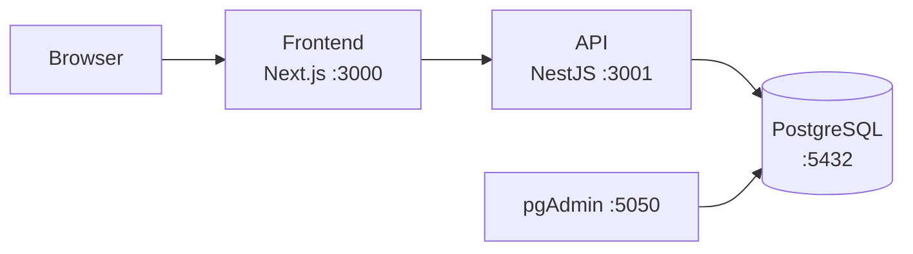

# Streaming Web

Full-stack live-streaming platform: subscription-gated access to live TV channels, with JWT authentication and single-active-session enforcement (logging in on a new device invalidates the previous one, Netflix-style).

## Features

- **Authentication** — Passport local + JWT strategies, token delivered as an HTTP-only cookie.
- **Single active session per account** — the API tracks the latest token issued per user; a login from a second device invalidates the first session.
- **Subscription expiry** — each account has an expiration date checked at login; expired accounts are rejected.
- **Live player** — channel list with an embedded player (`react-player`, lazy-loaded and SSR-safe).
- **One-command environment** — `docker compose up` brings up PostgreSQL, pgAdmin, the API and the frontend, networked together.

## Tech stack

| Layer    | Technologies |
|----------|--------------|
| Backend  | NestJS 9, TypeORM, PostgreSQL, Passport (local + JWT), class-validator |
| Frontend | Next.js, TypeScript, Chakra UI, Tailwind CSS + twin.macro, Zustand, react-hook-form + Zod, react-player |
| Testing  | Jest, Testing Library, MSW |
| Infra    | Docker Compose (PostgreSQL 15, pgAdmin, API, web) |

## Architecture



## Getting started

### With Docker (recommended)

```bash
docker compose up --build
```

| Service  | URL |
|----------|-----|
| Frontend | http://localhost:3000 |
| API      | http://localhost:3001 |
| pgAdmin  | http://localhost:5050 |

### Manual setup

Requires Node.js 18+ and a local PostgreSQL instance.

```bash
# Backend
cd backend
cp .env.example .env   # adjust DB credentials and JWT settings
pnpm install
pnpm start:dev

# Frontend
cd frontend
cp .env.example .env
npm install
npm run dev
```

## Project structure

```
├── backend/          # NestJS REST API
│   └── src/
│       ├── users/       # User entity, auth endpoints, session tracking
│       ├── guards/      # JWT and local auth guards
│       ├── strategies/  # Passport strategies
│       └── dto/         # Validated request DTOs
├── frontend/         # Next.js app
│   ├── components/   # Header, layout, video player, forms
│   ├── context/      # Auth context
│   └── pages/        # Routes
└── docker-compose.yml
```

## Possible next steps

- Refresh tokens and Redis-backed session registry (currently in-memory)
- CI pipeline with GitHub Actions
- End-to-end tests
